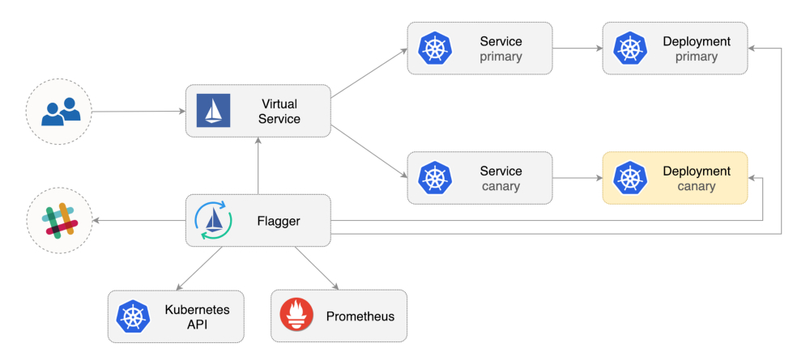
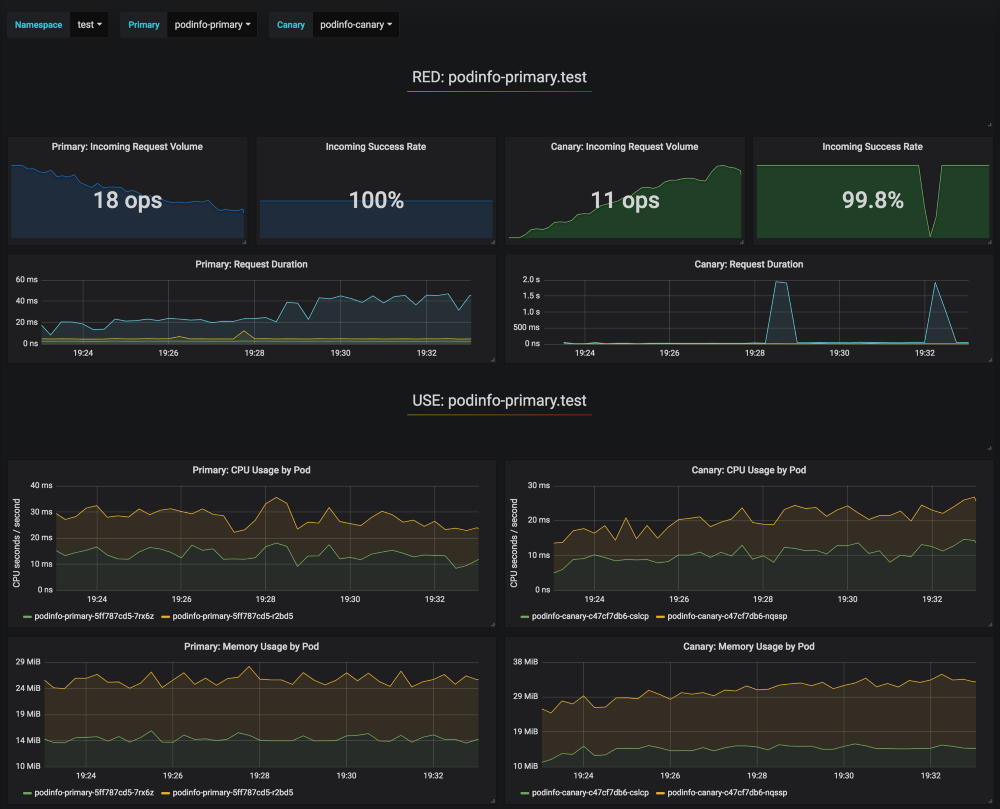
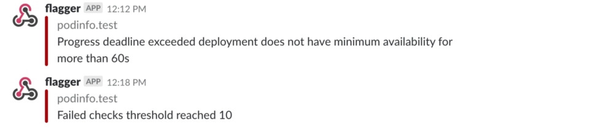

持续部署（Continuous delivery）符合企业软件实践，它是完善持续集成（continuous integration）原则的自然演化。
但持续部署案例却非常罕见，其中原因可能是需要复杂的管理以及担心部署失败而影响系统的可用性。

[Flagger](https://github.com/weaveworks/flagger)是一个开源的Kubernetes operator，旨在解决上述复杂性。它使用Istio切换流量并通过Prometheus指标分析业务应用在更新发布期间的状态表现。

以下是在Google Kubernetes Engine（GKE）环境安装和使用Flagger的步骤指导。

## 搭建Kubernetes cluster

首先创建GKE集群和Istio组件（如果你没有GCP帐号，点击[注册帐号](https://cloud.google.com/free/)）。
登录Google Cloud，创建项目并为其启用结算。安装[gcloud](https://cloud.google.com/sdk/)命令行工具，然后使用```gcloud init```配置项目。
设置默认项目，计算资源区域和地区（用实际项目ID替换```PROJECT_ID```）：

```bash
gcloud config set project PROJECT_ID
gcloud config set compute/region us-central1
gcloud config set compute/zone us-central1-a
```
开启GKE服务、创建集群并启用HPA和Istio组件
```bash
gcloud services enable container.googleapis.com

K8S_VERSION=$(gcloud beta container get-server-config --format=json | jq -r '.validMasterVersions[0]')
gcloud beta container clusters create istio \
--cluster-version=${K8S_VERSION} \
--zone=us-central1-a \
--num-nodes=2 \
--machine-type=n1-standard-2 \
--disk-size=30 \
--enable-autorepair \
--no-enable-cloud-logging \
--no-enable-cloud-monitoring \
--addons=HorizontalPodAutoscaling,Istio \
--istio-config=auth=MTLS_PERMISSIVE
```
上述命令会创建包含2台虚机的主机池（```n1-standard-2```，vCPU：2，RAM：7.5GB，DISK：30GB）。理想情况下，你可能希望将Istio组件与业务应用隔离部署，但并不容易实现将Istio独立部署于专属主机池。Istio manifest被设置为只读并且GKE会还原对node affinity或pod anti-affinity的任何修改。  

为```kubectl```设置证书：
```bash
gcloud container clusters get-credentials istio
```

为集群管理员创建role binding：
```bash
kubectl create clusterrolebinding "cluster-admin-$(whoami)" \
--clusterrole=cluster-admin \
--user="$(gcloud config get-value core/account)"
```

安装[Helm](https://docs.helm.sh/using_helm/#installing-helm)命令行工具：
```bash
brew install kubernetes-helm
```

Homebrew 2.0现在也支持[Linux](https://brew.sh/2019/02/02/homebrew-2.0.0/)。

为Tiller创建service account和cluster role binding：
```bash
kubectl -n kube-system create sa tiller && \
kubectl create clusterrolebinding tiller-cluster-rule \
--clusterrole=cluster-admin \
--serviceaccount=kube-system:tiller
```
在kube-system namespace下部署Tiller：
```bash
helm init --service-account tiller
```
你应该考虑在Helm与Tiller之间使用SSL，更多关于Helm启用安全安装的信息，请查看[docs.helm.sh](https://helm.sh/docs/using_helm/#securing-your-helm-installation)。

验证安装：
```bash
kubectl -n istio-system get svc
```
数秒后，GCP会为```istio-ingressgateway```分配一个external IP。
## 搭建Istio ingress gateway

用Istio ingress IP创建为一个名为```istio-gateway```的静态IP地址：
```bash
export GATEWAY_IP=$(kubectl -n istio-system get svc/istio-ingressgateway -ojson | jq -r .status.loadBalancer.ingress[0].ip)
gcloud compute addresses create istio-gateway --addresses ${GATEWAY_IP} --region us-central1
```
接下来，你需要一个互联网域名并访问你的DNS注册商。添加两条A记录（用你的域名替换```example.com```）：
```bash
istio.example.com   A ${GATEWAY_IP}
*.istio.example.com A ${GATEWAY_IP}
```
验证泛域名解析：
```bash
watch host test.istio.example.com
```
创建一个通用Istio gateway，并向外网暴露HTTP服务：
```yaml
apiVersion: networking.istio.io/v1alpha3
kind: Gateway
metadata:
  name: public-gateway
  namespace: istio-system
spec:
  selector:
    istio: ingressgateway
  servers:
    - port:
        number: 80
        name: http
        protocol: HTTP
      hosts:
        - "*"
```
将上述资源保存为public-gateway.yaml，然后应用它：
```bash
kubectl apply -f ./public-gateway.yaml
```
生产系统向互联网暴露服务应该使用SSL。关于使用cert-manager、CloudDNS和Let's Encrypt加固Istio ingress gateway的步骤，请查看Flagger GKE[文档](https://docs.flagger.app/install/flagger-install-on-google-cloud)。
## 安装Flagger

GKE Istio组件并不包含用来获取Istio遥测服务的Prometheus实例。由于Flagger使用Istio HTTP指标来运行金丝雀分析（canary analysis），你必须部署以下Prometheus配置，该配置类似官方Istio Helm chart。
```bash
REPO=https://raw.githubusercontent.com/weaveworks/flagger/master
kubectl apply -f ${REPO}/artifacts/gke/istio-prometheus.yaml
```
添加Flagger Helm仓库：
```bash
helm repo add flagger https://flagger.app
```
在```istio-system```namespace下部署Flagger，并开启Slack通知：
```bash
helm upgrade -i flagger flagger/flagger \
--namespace=istio-system \
--set metricsServer=http://prometheus.istio-system:9090 \
--set slack.url=https://hooks.slack.com/services/YOUR-WEBHOOK-ID \
--set slack.channel=general \
--set slack.user=flagger
```
可以在任何namespace下安装Flagger，只要它可以访问Istio Prometheus service的9090端口。
Flagger附带Grafana dashboard，用于金丝雀分析。在istio-system namespace下部署Grafana：
```bash
helm upgrade -i flagger-grafana flagger/grafana \
--namespace=istio-system \
--set url=http://prometheus.istio-system:9090 \
--set user=admin \
--set password=change-me
```
创建一个virtual service，使用公共gateway暴露Grafana（用你的域名替换```example.com```）：
```yaml
apiVersion: networking.istio.io/v1alpha3
kind: VirtualService
metadata:
  name: grafana
  namespace: istio-system
spec:
  hosts:
    - "grafana.istio.example.com"
  gateways:
    - public-gateway.istio-system.svc.cluster.local
  http:
    - route:
        - destination:
            host: flagger-grafana
```
将上述资源保存为grafana-virtual-service.yaml，然后应用它：
```bash
kubectl apply -f ./grafana-virtual-service.yaml
```
在浏览器中访问```http://grafana.istio.example.com```，会重定向到Grafana登录页面。
## 使用Flagger部署web应用

Flagger包含一个Kubernetes deployment和一个可选的horizontal pod autoscaler（HPA），然后创建一些资源对象（Kubernetes deployments， ClusterIP services和Istio virtual services）。这些资源对象会在网络上暴露应用并实现金丝雀分析和升级。

创建一个test namespace，并开启Istio sidecar注入：

```bash
REPO=https://raw.githubusercontent.com/weaveworks/flagger/master
kubectl apply -f ${REPO}/artifacts/namespaces/test.yaml
```
创建一个deployment和HPA：
```bash
kubectl apply -f ${REPO}/artifacts/canaries/deployment.yaml
kubectl apply -f ${REPO}/artifacts/canaries/hpa.yaml
```
在金丝雀分析期间，部署产生测试流量的服务：
```bash
helm upgrade -i flagger-loadtester flagger/loadtester \
--namepace=test
```
创建一个金丝雀custom resource（用你的域名替换```example.com```）：
```yaml
apiVersion: flagger.app/v1alpha3
kind: Canary
metadata:
  name: podinfo
  namespace: test
spec:
  targetRef:
    apiVersion: apps/v1
    kind: Deployment
    name: podinfo
  progressDeadlineSeconds: 60
  autoscalerRef:
    apiVersion: autoscaling/v2beta1
    kind: HorizontalPodAutoscaler
    name: podinfo
  service:
    port: 9898
    gateways:
    - public-gateway.istio-system.svc.cluster.local
    hosts:
    - app.istio.example.com
  canaryAnalysis:
    interval: 30s
    threshold: 10
    maxWeight: 50
    stepWeight: 5
    metrics:
    - name: istio_requests_total
      threshold: 99
      interval: 30s
    - name: istio_request_duration_seconds_bucket
      threshold: 500
      interval: 30s
    webhooks:
      - name: load-test
        url: http://flagger-loadtester.test/
        timeout: 5s
        metadata:
          cmd: "hey -z 1m -q 10 -c 2 http://podinfo.test:9898/"
```
将上述资源保存为podinfo-canary.yaml，然后应用它：
```bash
kubectl apply -f ./podinfo-canary.yaml
```
如果成功，上述分析将运行五分钟，并且每半分钟验证一次HTTP指标。使用这个公式来判断金丝雀部署所需的最小时间：```interval * (maxWeight / stepWeight)```。金丝雀CRD定义[文档](https://docs.flagger.app/how-it-works#canary-custom-resource)。

数秒后，Flagger会创建金丝雀资源对象：

```bash
# applied
deployment.apps/podinfo
horizontalpodautoscaler.autoscaling/podinfo
canary.flagger.app/podinfo
# generated
deployment.apps/podinfo-primary
horizontalpodautoscaler.autoscaling/podinfo-primary
service/podinfo
service/podinfo-canary
service/podinfo-primary
virtualservice.networking.istio.io/podinfo
```
打开浏览器访问```app.istio.example.com```，你会看到[demo app](https://github.com/stefanprodan/k8s-podinfo)的版本号。

## 自动金丝雀分析和升级

Flagger实现了一个控制循环，逐渐将流量转移到金丝雀，同时测量HTTP请求成功率等关键性能指标，请求平均持续时间以及pod健康状态。根据对KPI的分析，升级或中止金丝雀部署，并将分析结果发送到Slack。

以下对象的更改会触发金丝雀部署：

- Deployment PodSpec（容器image，command，ports，env等）
- ConfigMaps作为卷挂载或映射到环境变量
- Secrets作为卷挂载或映射到环境变量
通过更新容器image触发金丝雀部署：
```bash
kubectl -n test set image deployment/podinfo \
podinfod=quay.io/stefanprodan/podinfo:1.4.1
```

Flagger检测到deployment的版本已更新，于是开始分析它：

```bash
kubectl -n test describe canary/podinfo

Events:

New revision detected podinfo.test
Scaling up podinfo.test
Waiting for podinfo.test rollout to finish: 0 of 1 updated replicas are available
Advance podinfo.test canary weight 5
Advance podinfo.test canary weight 10
Advance podinfo.test canary weight 15
Advance podinfo.test canary weight 20
Advance podinfo.test canary weight 25
Advance podinfo.test canary weight 30
Advance podinfo.test canary weight 35
Advance podinfo.test canary weight 40
Advance podinfo.test canary weight 45
Advance podinfo.test canary weight 50
Copying podinfo.test template spec to podinfo-primary.test
Waiting for podinfo-primary.test rollout to finish: 1 of 2 updated replicas are available
Promotion completed! Scaling down podinfo.test
```

在分析过程中，可以使用Grafana监控金丝雀的进展：



请注意，如果在金丝雀分析期间对deployment应用新的更改，Flagger将重新启动分析阶段。

列出群集中所有的金丝雀：

```bash
watch kubectl get canaries --all-namespaces
NAMESPACE   NAME      STATUS        WEIGHT   LASTTRANSITIONTIME
test        podinfo   Progressing   15       2019-01-16T14:05:07Z
prod        frontend  Succeeded     0        2019-01-15T16:15:07Z
prod        backend   Failed        0        2019-01-14T17:05:07Z
```

如果你启用了Slack通知，则会收到以下消息：


## 自动回滚

在金丝雀分析期间，可以生成HTTP 500错误和高响应延迟，以测试Flagger是否暂停升级。

创建一个test pod并执行：

```bash
kubectl -n test run tester \
--image=quay.io/stefanprodan/podinfo:1.2.1 \
-- ./podinfo --port=9898
kubectl -n test exec -it tester-xx-xx sh
```

生成HTTP 500错误返回：

```bash
watch curl http://podinfo-canary:9898/status/500
```

生成延迟：

```bash
watch curl http://podinfo-canary:9898/delay/1
```

当失败检查的数量达到金丝雀分析阈值时，流量被路由回主版本，金丝雀版本被缩放为0，并且升级被标记为失败。

金丝雀报错和延迟峰值被记录为Kubernetes事件，并由Flagger以JSON日志记录：

```bash
kubectl -n istio-system logs deployment/flagger -f | jq .msg

Starting canary deployment for podinfo.test
Advance podinfo.test canary weight 5
Advance podinfo.test canary weight 10
Advance podinfo.test canary weight 15
Halt podinfo.test advancement success rate 69.17% < 99%
Halt podinfo.test advancement success rate 61.39% < 99%
Halt podinfo.test advancement success rate 55.06% < 99%
Halt podinfo.test advancement success rate 47.00% < 99%
Halt podinfo.test advancement success rate 37.00% < 99%
Halt podinfo.test advancement request duration 1.515s > 500ms
Halt podinfo.test advancement request duration 1.600s > 500ms
Halt podinfo.test advancement request duration 1.915s > 500ms
Halt podinfo.test advancement request duration 2.050s > 500ms
Halt podinfo.test advancement request duration 2.515s > 500ms
Rolling back podinfo.test failed checks threshold reached 10
Canary failed! Scaling down podinfo.test
```

如果你启用了Slack通知，当超出了进度超时，或者分析达到了最大失败次数，你将收到一条消息：



# 总结

在Kubernetes之上运行像Istio这样的服务网格可以为你提供自动度量标准，日志和跟踪，但是业务应用的部署仍然依赖于外部工具。Flagger旨在扩展Istio，使其具备[渐进式交付能力](<https://redmonk.com/jgovernor/2018/08/06/towards-progressive-delivery/>)。

Flagger兼容所有Kubernetes CI/CD方案，并且可以使用[webhook](<https://docs.flagger.app/how-it-works>)轻松扩展金丝雀分析，以运行系统集成/验收测试，负载测试或任何其他自定义验证。由于Flagger是声明性的并且对Kubernetes事件做出反应，因此它可以与[Weave Flux](<https://www.weave.works/oss/flux/>)或[JenkinsX](<https://jenkins-x.io/>)一起用于GitOps流水线。如果你使用的是JenkinsX，则可以使用jx插件安装Flagger。

Flagger由[Weaveworks](<https://www.weave.works/>)赞助，并为[Weave Cloud](<https://www.weave.works/product/cloud/>)中的金丝雀部署提供支持。该项目正在GKE，EKS和kubeadm安装的物理机群上进行测试。

如果您对Flagger有任何改进建议，请在GitHub[weaveworks/flagger](<https://github.com/weaveworks/flagger>)上提交issue或PR。非常欢迎贡献！
