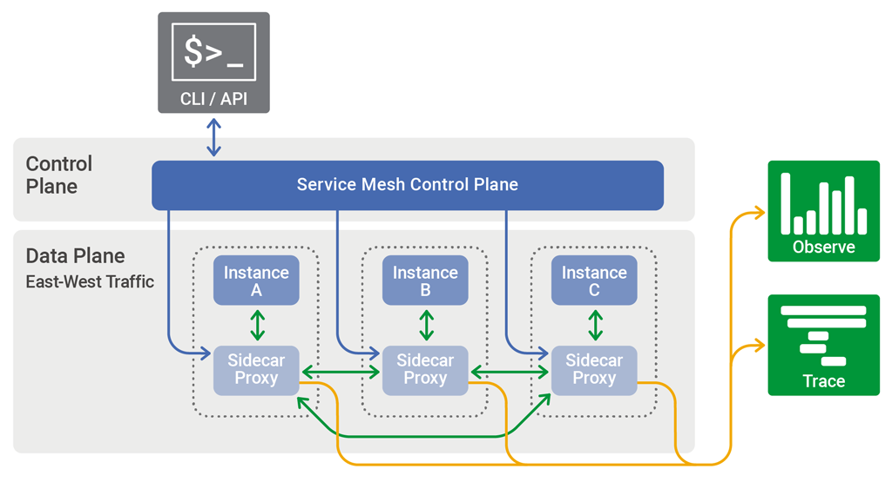

[编者按]

> 原文的两位作者对服务网格做了一个简要介绍，并对相关关键术语也做了解释，是一篇很好、简短的服务网格入门参考文档

服务网格是一种可配置、低延迟的基础结构层，被设计用于处理大量基于网络，基于API接口的应用程序间调用。服务网格用于保证容器间那些转瞬即逝的互相调用是高速、可靠并且安全的。网格提供关键能力，包括服务发现，负载均衡，加密，可观察，可追踪，具备认证与授权，并且支持断路器模式。

服务网格通常会为每一个服务实例提供一个代理实例(proxy instance)，一般叫做边车(sidecar)。边车用于处理服务间通信，监控以及安全相关问题--事实上，任何可以从服务实例抽象出来的东西，都可以放到边车里面。通过这种方式，开发者可以专注于处理开发、支持以及维护应用程序代码；运维团队可以维护服务网格以保证应用程序可用。

Istio，发源于Google, IBM和Lyft，是当前最为知名的服务网格架构。Kubernetes，最早由Google设计，是现在唯一一个被Istio支持的容器调度框架（framework）。供应商不断再尝试寻找商业支持的Istio。我们很期待他们能够给开源社区带来价值。

Istio并不是唯一的选择，还有一些其它的服务网格实现正在开发中。边车代理模式是目前最流行的，并且在Buoyant, HashiCorp, Solo.io及其它厂商的项目中使用。我们也有其它备选方案：Netflix的技术包也是其中的一种，在他们的方案中，服务网格主要通过应用程序包的方式被提供出来（Ribbon, Hysterix, Eureka, Archaius）。Azure的Service Fabric平台，通过在应用程序框架中内嵌服务网格类的能力，来达到同样的效果。

服务网格包含了一些约定俗成的术语：

- **容器编排框架.** 随着越来越多的容器加入到应用程序基础架构中，一个独立的，用于监控和管理这些容器的工具-*容器编排框架*-就变为必需品。Kubernetes应运而生，当然也有其他竞争者，Docker Storm和Mesosphere DC/OS，这些产品也提供与Kubernetes的集成。
- **服务与实例.（Kubernetes pods）** 实例是一个运行状态的微服务的副本。有时候实例也指一个单独的容器；在Kubernetes里面，一个实例是由一小组相互独立的容器（称作pod）组成。客户端通常访问*服务*而不是具体的实例或pod，因为服务是由一系列实例或pod组成，提供了扩展和容错功能。
- **边车代理.** *边车代理*并行运行在一个单独实例或pod旁边。它的目的是为了路由，或称代理，也就是解决它并行的容器的对内/对外访问。该实例的边车与其他边车代理沟通，并且受容器编排框架的调度。很多服务网格通过这种边车代理模式来管理实例或pod的入站(*ingress*)和出站(*egress*)访问。
- **服务发现.** 当一个实例需要和其它服务交互时，它需要能够找到-发现-其它服务的一个健康，可用的实例。通常是通过一次DNS查询来达到这个目标。容器编排框架会维护一个实例列表，用于接收这些请求并为DNS查询提供接口。
- **加密.** 服务网格可以对请求和响应内容进行加密与解密操作，从而减轻各个服务的负担。同样网格也可以通过重用已有的、持续的连接，降低创建新连接的昂贵成本，从而来提高性能。最常见的加密方式是双向TLS(mTLS)，公钥基础设施（PKI）生成证书和密钥，以供边车代理使用。
- **认证和授权.** 服务网格可以同时在应用程序外或者内进行认证与授权逻辑，确保发送到实例的请求都是合法的。
- **断路器模式支持.** 服务网格可以支持[断路器模式](https://www.nginx.com/blog/microservices-reference-architecture-nginx-circuit-breaker-pattern)，这种方式可以切断不健康的实例，并在它们恢复健康后，重新回到服务实例池内。

服务网格中管理实例间网络流量的部分被称作*数据平面*。控制数据平面的那些配置信息，是由另一个*控制平面*来产生并部署的。控制平面通常包括，或者说被设计用于连接至API，命令行，并且提供一个图形化界面用于管理。

控制平面用于数据平面中sidecar的配置项的分发

服务网格这种架构是用于解决使用容器和[微服务](https://www.nginx.com/blog/introduction-to-microservices/)后，对运维越来越高的要求。微服务领域的先行者包括Lyft, Netflix, Twitter，每一个都为每小时进进出出达到全球百万计的用户提供健壮的服务。（可以参考另一篇更加深入的文章[architectural challenges facing Netflix](https://www.nginx.com/blog/microservices-at-netflix-architectural-best-practices/).）对于那些没这么复杂的应用程序需求，一个简单的架构就足够了。

服务网格架构并不是解决所有应用程序运维和部署问题的灵丹妙药。架构师和开发者们有很多很好的工具，只有一种工具是榔头，同时，各种各样的问题中，也只有一类问题是钉子。NGINX的[微服务架构参考](https://www.nginx.com/blog/introducing-the-nginx-microservices-reference-architecture/)，包含了一系列不同的模型，并给出了一系列通过微服务的方法解决各种不同问题的方法。

这些元素共同构成了服务网格架构--包含NGINX，容器，Kubernetes，与微服务架构方法--可以被用在，同时也被高效的用在非服务网格实现方法上。比如，Istio最早被当作完整的服务网格架构来开发，但是它的模块化使得开发者可以随时只选取他们需要的部分来使用。顺着这种思路，哪怕你并不确定是否需要，什么时候需要实现完整的服务网格应用，了解服务网格的概念也是非常有必要的。
